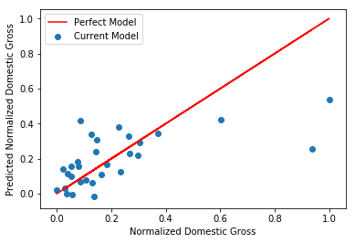
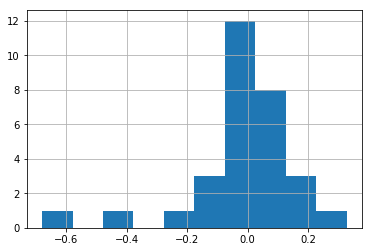
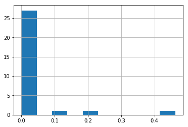

# Here's some data!


```python
import pandas as pd
```

### 1. Import the data. It's stored in a file called 'movie_data_detailed.xlsx'.


```python
ls
```

    README.md                 index.ipynb               movie_data_detailed.xlsx


```python
df = pd.read_excel('movie_data_detailed.xlsx')
print(len(df))
df.head()
```

    30


<div>
<style scoped>
    .dataframe tbody tr th:only-of-type {
        vertical-align: middle;
    }

    .dataframe tbody tr th {
        vertical-align: top;
    }

    .dataframe thead th {
        text-align: right;
    }
</style>
<table border="1" class="dataframe">
  <thead>
    <tr style="text-align: right;">
      <th></th>
      <th>budget</th>
      <th>domgross</th>
      <th>title</th>
      <th>Response_Json</th>
      <th>Year</th>
      <th>imdbRating</th>
      <th>Metascore</th>
      <th>imdbVotes</th>
    </tr>
  </thead>
  <tbody>
    <tr>
      <th>0</th>
      <td>13000000</td>
      <td>25682380</td>
      <td>21 &amp;amp; Over</td>
      <td>NaN</td>
      <td>2008.0</td>
      <td>6.8</td>
      <td>48.0</td>
      <td>206513.0</td>
    </tr>
    <tr>
      <th>1</th>
      <td>45658735</td>
      <td>13414714</td>
      <td>Dredd 3D</td>
      <td>NaN</td>
      <td>2012.0</td>
      <td>NaN</td>
      <td>NaN</td>
      <td>NaN</td>
    </tr>
    <tr>
      <th>2</th>
      <td>20000000</td>
      <td>53107035</td>
      <td>12 Years a Slave</td>
      <td>NaN</td>
      <td>2013.0</td>
      <td>8.1</td>
      <td>96.0</td>
      <td>537525.0</td>
    </tr>
    <tr>
      <th>3</th>
      <td>61000000</td>
      <td>75612460</td>
      <td>2 Guns</td>
      <td>NaN</td>
      <td>2013.0</td>
      <td>6.7</td>
      <td>55.0</td>
      <td>173726.0</td>
    </tr>
    <tr>
      <th>4</th>
      <td>40000000</td>
      <td>95020213</td>
      <td>42</td>
      <td>NaN</td>
      <td>2013.0</td>
      <td>7.5</td>
      <td>62.0</td>
      <td>74170.0</td>
    </tr>
  </tbody>
</table>
</div>


### 2. Fill all with the column mean.
Old: Fill all the null values with zero.


```python
for col in df.columns:
    try:
        mean = df[col].mean()
        df[col] = df[col].fillna(value=mean)
    except:
        #Col is text
        pass
df.head()
```


<div>
<style scoped>
    .dataframe tbody tr th:only-of-type {
        vertical-align: middle;
    }

    .dataframe tbody tr th {
        vertical-align: top;
    }

    .dataframe thead th {
        text-align: right;
    }
</style>
<table border="1" class="dataframe">
  <thead>
    <tr style="text-align: right;">
      <th></th>
      <th>budget</th>
      <th>domgross</th>
      <th>title</th>
      <th>Response_Json</th>
      <th>Year</th>
      <th>imdbRating</th>
      <th>Metascore</th>
      <th>imdbVotes</th>
    </tr>
  </thead>
  <tbody>
    <tr>
      <th>0</th>
      <td>13000000</td>
      <td>25682380</td>
      <td>21 &amp;amp; Over</td>
      <td>NaN</td>
      <td>2008.0</td>
      <td>6.800000</td>
      <td>48.0</td>
      <td>206513.000000</td>
    </tr>
    <tr>
      <th>1</th>
      <td>45658735</td>
      <td>13414714</td>
      <td>Dredd 3D</td>
      <td>NaN</td>
      <td>2012.0</td>
      <td>6.748148</td>
      <td>57.5</td>
      <td>201890.923077</td>
    </tr>
    <tr>
      <th>2</th>
      <td>20000000</td>
      <td>53107035</td>
      <td>12 Years a Slave</td>
      <td>NaN</td>
      <td>2013.0</td>
      <td>8.100000</td>
      <td>96.0</td>
      <td>537525.000000</td>
    </tr>
    <tr>
      <th>3</th>
      <td>61000000</td>
      <td>75612460</td>
      <td>2 Guns</td>
      <td>NaN</td>
      <td>2013.0</td>
      <td>6.700000</td>
      <td>55.0</td>
      <td>173726.000000</td>
    </tr>
    <tr>
      <th>4</th>
      <td>40000000</td>
      <td>95020213</td>
      <td>42</td>
      <td>NaN</td>
      <td>2013.0</td>
      <td>7.500000</td>
      <td>62.0</td>
      <td>74170.000000</td>
    </tr>
  </tbody>
</table>
</div>


### 3. Normalize the data so that all features have a minimum of zero and a maximum of one.

* Subtract minimum
* Divide range

Thought experiment:

(miminum - minimum)  / range 

0 / range = 0

Remember range = max - min

(maximum - minimum) / range
(maximum - minimum) / (maximum - minimum) = 1 


```python
print(df.budget.min(), df.budget.max())
```

    5500000 225000000


```python
#Apply is to the entire column
def normalize_func(value):
    output = (value - minimum) / range_
    return output
# df[col_name] = df[col_name].apply(normalize_func)
minimum = df['budget'].min()
maximum = df['budget'].max()
range_ = maximum - minimum
df['budget'] = df['budget'].map(normalize_func)
```


```python
print(df.budget.min(), df.budget.max())
```

    0.0 1.0


```python
df.info()
```

    <class 'pandas.core.frame.DataFrame'>
    RangeIndex: 30 entries, 0 to 29
    Data columns (total 8 columns):
    budget           30 non-null float64
    domgross         30 non-null float64
    title            30 non-null object
    Response_Json    30 non-null float64
    Year             30 non-null float64
    imdbRating       30 non-null float64
    Metascore        30 non-null float64
    imdbVotes        30 non-null float64
    dtypes: float64(7), object(1)
    memory usage: 2.0+ KB


```python
for col in df.columns:
    try:
        minimum = df[col].min()
        maximum = df[col].max()
        print('{}, Minimum: {}, Maximum: {}'.format(col, minimum, maximum))
        range_ = maximum - minimum
        df[col] = df[col].map(normalize_func)
        print('{}, Minimum: {}, Maximum: {}'.format(col, df[col].min(), df[col].max()))
        print('\n')
    except:
        print('Column {} is probably not numeric.'.format(col))
```

    budget, Minimum: 5500000, Maximum: 225000000
    budget, Minimum: 0.0, Maximum: 1.0
    
    
    domgross, Minimum: 4167493, Maximum: 393050114
    domgross, Minimum: 0.0, Maximum: 1.0
    
    
    title, Minimum: 12 Years a Slave, Maximum: Gloria
    Column title is probably not numeric.
    Response_Json, Minimum: nan, Maximum: nan
    Response_Json, Minimum: nan, Maximum: nan
    
    
    Year, Minimum: 1976.0, Maximum: 2013.0
    Year, Minimum: 0.0, Maximum: 1.0
    
    
    imdbRating, Minimum: 4.9, Maximum: 8.1
    imdbRating, Minimum: 0.0, Maximum: 1.0
    
    
    Metascore, Minimum: 28.0, Maximum: 96.0
    Metascore, Minimum: 0.0, Maximum: 1.0
    
    
    imdbVotes, Minimum: 22430.0, Maximum: 537525.0
    imdbVotes, Minimum: 0.0, Maximum: 1.0
    
    


```python
#Map applies value by value
def normalize_func(values, min, max):
    return output
df[col_name] = df[col_name].map(normalize_func)
```


```python
[1,2,3]*5
```


    [1, 2, 3, 1, 2, 3, 1, 2, 3, 1, 2, 3, 1, 2, 3]


```python
import numpy as np
```


```python
np.array([1,2,3])*5
```


    array([ 5, 10, 15])


```python
df.head()
```


<div>
<style scoped>
    .dataframe tbody tr th:only-of-type {
        vertical-align: middle;
    }

    .dataframe tbody tr th {
        vertical-align: top;
    }

    .dataframe thead th {
        text-align: right;
    }
</style>
<table border="1" class="dataframe">
  <thead>
    <tr style="text-align: right;">
      <th></th>
      <th>budget</th>
      <th>domgross</th>
      <th>title</th>
      <th>Response_Json</th>
      <th>Year</th>
      <th>imdbRating</th>
      <th>Metascore</th>
      <th>imdbVotes</th>
    </tr>
  </thead>
  <tbody>
    <tr>
      <th>0</th>
      <td>0.034169</td>
      <td>0.055325</td>
      <td>21 &amp;amp; Over</td>
      <td>NaN</td>
      <td>0.864865</td>
      <td>0.593750</td>
      <td>0.294118</td>
      <td>0.357377</td>
    </tr>
    <tr>
      <th>1</th>
      <td>0.182956</td>
      <td>0.023779</td>
      <td>Dredd 3D</td>
      <td>NaN</td>
      <td>0.972973</td>
      <td>0.577546</td>
      <td>0.433824</td>
      <td>0.348404</td>
    </tr>
    <tr>
      <th>2</th>
      <td>0.066059</td>
      <td>0.125847</td>
      <td>12 Years a Slave</td>
      <td>NaN</td>
      <td>1.000000</td>
      <td>1.000000</td>
      <td>1.000000</td>
      <td>1.000000</td>
    </tr>
    <tr>
      <th>3</th>
      <td>0.252847</td>
      <td>0.183719</td>
      <td>2 Guns</td>
      <td>NaN</td>
      <td>1.000000</td>
      <td>0.562500</td>
      <td>0.397059</td>
      <td>0.293724</td>
    </tr>
    <tr>
      <th>4</th>
      <td>0.157175</td>
      <td>0.233625</td>
      <td>42</td>
      <td>NaN</td>
      <td>1.000000</td>
      <td>0.812500</td>
      <td>0.500000</td>
      <td>0.100447</td>
    </tr>
  </tbody>
</table>
</div>


### 4. Define 4 variables: X_train, Y_train, X_test, Y_test using a 80-20 split for train and test data. X should be a matrix of data features predicting y, Domestic Gross Sales.  Use random_state=42 for consistency.


```python
from sklearn.model_selection import train_test_split
```


```python
X = df[['budget', 'Year', 'imdbRating', 'Metascore', 'imdbVotes']]
# X = df.drop('domgross')
y = df['domgross']
```


```python
X_train, X_test, y_train, y_test = train_test_split(X, y, test_size=0.2, random_state=42)
```

### 5. Import import sklearn.linear_model.LinearRegression
Create an instance of the LinearRegression class.
Then use the fit method to train a model according to the data.


```python
import sklearn.linear_model as linreg
```


```python
#Create Instance of LinearRegression (Ordinary Least Squares Regressor)
model = linreg.LinearRegression()
```


```python
#Fit the model to the train set
model.fit(X_train, y_train)
```


    LinearRegression(copy_X=True, fit_intercept=True, n_jobs=1, normalize=False)


```python
df['Predicted Value'] = model.predict(X)
df.head()
```


<div>
<style scoped>
    .dataframe tbody tr th:only-of-type {
        vertical-align: middle;
    }

    .dataframe tbody tr th {
        vertical-align: top;
    }

    .dataframe thead th {
        text-align: right;
    }
</style>
<table border="1" class="dataframe">
  <thead>
    <tr style="text-align: right;">
      <th></th>
      <th>budget</th>
      <th>domgross</th>
      <th>title</th>
      <th>Response_Json</th>
      <th>Year</th>
      <th>imdbRating</th>
      <th>Metascore</th>
      <th>imdbVotes</th>
      <th>Predicted Value</th>
      <th>Residual</th>
      <th>PercentError</th>
      <th>Squarred Residual</th>
    </tr>
  </thead>
  <tbody>
    <tr>
      <th>0</th>
      <td>0.034169</td>
      <td>0.055325</td>
      <td>21 &amp;amp; Over</td>
      <td>NaN</td>
      <td>0.864865</td>
      <td>0.593750</td>
      <td>0.294118</td>
      <td>0.357377</td>
      <td>-0.004443</td>
      <td>-0.059768</td>
      <td>-1.080302</td>
      <td>0.003572</td>
    </tr>
    <tr>
      <th>1</th>
      <td>0.182956</td>
      <td>0.023779</td>
      <td>Dredd 3D</td>
      <td>NaN</td>
      <td>0.972973</td>
      <td>0.577546</td>
      <td>0.433824</td>
      <td>0.348404</td>
      <td>0.142802</td>
      <td>0.119023</td>
      <td>5.005394</td>
      <td>0.014166</td>
    </tr>
    <tr>
      <th>2</th>
      <td>0.066059</td>
      <td>0.125847</td>
      <td>12 Years a Slave</td>
      <td>NaN</td>
      <td>1.000000</td>
      <td>1.000000</td>
      <td>1.000000</td>
      <td>1.000000</td>
      <td>0.338656</td>
      <td>0.212810</td>
      <td>1.691024</td>
      <td>0.045288</td>
    </tr>
    <tr>
      <th>3</th>
      <td>0.252847</td>
      <td>0.183719</td>
      <td>2 Guns</td>
      <td>NaN</td>
      <td>1.000000</td>
      <td>0.562500</td>
      <td>0.397059</td>
      <td>0.293724</td>
      <td>0.165040</td>
      <td>-0.018678</td>
      <td>-0.101667</td>
      <td>0.000349</td>
    </tr>
    <tr>
      <th>4</th>
      <td>0.157175</td>
      <td>0.233625</td>
      <td>42</td>
      <td>NaN</td>
      <td>1.000000</td>
      <td>0.812500</td>
      <td>0.500000</td>
      <td>0.100447</td>
      <td>0.122738</td>
      <td>-0.110887</td>
      <td>-0.474637</td>
      <td>0.012296</td>
    </tr>
  </tbody>
</table>
</div>


```python
y_hat_train = model.predict(X_train)
y_hat_test = model.predict(X_test)
```

### 6. Scatter Plot <a id="scatter"></a>  
Create a Scatter Plot of the budget and  Domestic Gross (domgross) along with your model's predictions.


```python
%matplotlib inline
import matplotlib.pyplot as plt
```


```python
#Scatter Plot
# x = np.linspace(start = 0, stop = 1, num = 1000 )
# plt.scatter(x, x, c='red', label='Perfect Model')
plt.plot(df.domgross, df.domgross, c='red', label='Perfect Model')
# plt.scatter(df.domgross, df.domgross, c='red', label='Perfect Model')
plt.scatter(df.domgross, df['Predicted Value'], label='Current Model')
plt.xlabel('Normalized Domestic Gross')
plt.ylabel('Predicted Normalized Domestic Gross')
plt.legend()
```


    <matplotlib.legend.Legend at 0x1a17d5c4e0>





### 7. Calculate the RSS for both the train and test sets.
Define a function called rss(y,y_hat). Call it on the train and test sets.


```python
def rss(y, y_hat):
    residuals = y_hat - y
    squarred_err = [err**2 for err in residuals]
    return sum(squarred_err)
```


```python
df.head()
```


<div>
<style scoped>
    .dataframe tbody tr th:only-of-type {
        vertical-align: middle;
    }

    .dataframe tbody tr th {
        vertical-align: top;
    }

    .dataframe thead th {
        text-align: right;
    }
</style>
<table border="1" class="dataframe">
  <thead>
    <tr style="text-align: right;">
      <th></th>
      <th>budget</th>
      <th>domgross</th>
      <th>title</th>
      <th>Response_Json</th>
      <th>Year</th>
      <th>imdbRating</th>
      <th>Metascore</th>
      <th>imdbVotes</th>
      <th>Predicted Value</th>
    </tr>
  </thead>
  <tbody>
    <tr>
      <th>0</th>
      <td>0.034169</td>
      <td>0.055325</td>
      <td>21 &amp;amp; Over</td>
      <td>NaN</td>
      <td>0.864865</td>
      <td>0.593750</td>
      <td>0.294118</td>
      <td>0.357377</td>
      <td>-0.004443</td>
    </tr>
    <tr>
      <th>1</th>
      <td>0.182956</td>
      <td>0.023779</td>
      <td>Dredd 3D</td>
      <td>NaN</td>
      <td>0.972973</td>
      <td>0.577546</td>
      <td>0.433824</td>
      <td>0.348404</td>
      <td>0.142802</td>
    </tr>
    <tr>
      <th>2</th>
      <td>0.066059</td>
      <td>0.125847</td>
      <td>12 Years a Slave</td>
      <td>NaN</td>
      <td>1.000000</td>
      <td>1.000000</td>
      <td>1.000000</td>
      <td>1.000000</td>
      <td>0.338656</td>
    </tr>
    <tr>
      <th>3</th>
      <td>0.252847</td>
      <td>0.183719</td>
      <td>2 Guns</td>
      <td>NaN</td>
      <td>1.000000</td>
      <td>0.562500</td>
      <td>0.397059</td>
      <td>0.293724</td>
      <td>0.165040</td>
    </tr>
    <tr>
      <th>4</th>
      <td>0.157175</td>
      <td>0.233625</td>
      <td>42</td>
      <td>NaN</td>
      <td>1.000000</td>
      <td>0.812500</td>
      <td>0.500000</td>
      <td>0.100447</td>
      <td>0.122738</td>
    </tr>
  </tbody>
</table>
</div>


```python
df['Residual'] = df['Predicted Value'] - df['domgross']
df.head()
```


<div>
<style scoped>
    .dataframe tbody tr th:only-of-type {
        vertical-align: middle;
    }

    .dataframe tbody tr th {
        vertical-align: top;
    }

    .dataframe thead th {
        text-align: right;
    }
</style>
<table border="1" class="dataframe">
  <thead>
    <tr style="text-align: right;">
      <th></th>
      <th>budget</th>
      <th>domgross</th>
      <th>title</th>
      <th>Response_Json</th>
      <th>Year</th>
      <th>imdbRating</th>
      <th>Metascore</th>
      <th>imdbVotes</th>
      <th>Predicted Value</th>
      <th>Residual</th>
    </tr>
  </thead>
  <tbody>
    <tr>
      <th>0</th>
      <td>0.034169</td>
      <td>0.055325</td>
      <td>21 &amp;amp; Over</td>
      <td>NaN</td>
      <td>0.864865</td>
      <td>0.593750</td>
      <td>0.294118</td>
      <td>0.357377</td>
      <td>-0.004443</td>
      <td>-0.059768</td>
    </tr>
    <tr>
      <th>1</th>
      <td>0.182956</td>
      <td>0.023779</td>
      <td>Dredd 3D</td>
      <td>NaN</td>
      <td>0.972973</td>
      <td>0.577546</td>
      <td>0.433824</td>
      <td>0.348404</td>
      <td>0.142802</td>
      <td>0.119023</td>
    </tr>
    <tr>
      <th>2</th>
      <td>0.066059</td>
      <td>0.125847</td>
      <td>12 Years a Slave</td>
      <td>NaN</td>
      <td>1.000000</td>
      <td>1.000000</td>
      <td>1.000000</td>
      <td>1.000000</td>
      <td>0.338656</td>
      <td>0.212810</td>
    </tr>
    <tr>
      <th>3</th>
      <td>0.252847</td>
      <td>0.183719</td>
      <td>2 Guns</td>
      <td>NaN</td>
      <td>1.000000</td>
      <td>0.562500</td>
      <td>0.397059</td>
      <td>0.293724</td>
      <td>0.165040</td>
      <td>-0.018678</td>
    </tr>
    <tr>
      <th>4</th>
      <td>0.157175</td>
      <td>0.233625</td>
      <td>42</td>
      <td>NaN</td>
      <td>1.000000</td>
      <td>0.812500</td>
      <td>0.500000</td>
      <td>0.100447</td>
      <td>0.122738</td>
      <td>-0.110887</td>
    </tr>
  </tbody>
</table>
</div>


```python
df['PercentError'] = df['Residual'] / df.domgross
df.head(2)
```


<div>
<style scoped>
    .dataframe tbody tr th:only-of-type {
        vertical-align: middle;
    }

    .dataframe tbody tr th {
        vertical-align: top;
    }

    .dataframe thead th {
        text-align: right;
    }
</style>
<table border="1" class="dataframe">
  <thead>
    <tr style="text-align: right;">
      <th></th>
      <th>budget</th>
      <th>domgross</th>
      <th>title</th>
      <th>Response_Json</th>
      <th>Year</th>
      <th>imdbRating</th>
      <th>Metascore</th>
      <th>imdbVotes</th>
      <th>Predicted Value</th>
      <th>Residual</th>
      <th>PercentError</th>
    </tr>
  </thead>
  <tbody>
    <tr>
      <th>0</th>
      <td>0.034169</td>
      <td>0.055325</td>
      <td>21 &amp;amp; Over</td>
      <td>NaN</td>
      <td>0.864865</td>
      <td>0.593750</td>
      <td>0.294118</td>
      <td>0.357377</td>
      <td>-0.004443</td>
      <td>-0.059768</td>
      <td>-1.080302</td>
    </tr>
    <tr>
      <th>1</th>
      <td>0.182956</td>
      <td>0.023779</td>
      <td>Dredd 3D</td>
      <td>NaN</td>
      <td>0.972973</td>
      <td>0.577546</td>
      <td>0.433824</td>
      <td>0.348404</td>
      <td>0.142802</td>
      <td>0.119023</td>
      <td>5.005394</td>
    </tr>
  </tbody>
</table>
</div>


```python
df[df.columns[-2:]].mean()
```


    Residual       -0.015108
    PercentError         inf
    dtype: float64


```python
df.Residual.hist()
```


    <matplotlib.axes._subplots.AxesSubplot at 0x1a17ad0320>





```python
(-.6)**2
```


    0.36


```python
(0.1)**2
```


    0.010000000000000002


```python
df['Squarred Residual'] = df.Residual.map(lambda x: x**2)
df['Squarred Residual'].hist()
```


    <matplotlib.axes._subplots.AxesSubplot at 0x1a17be8f98>





```python
#Scatter Plot
# x = np.linspace(start = 0, stop = 1, num = 1000 )
# plt.scatter(x, x, c='red', label='Perfect Model')
plt.plot(df.domgross, df.domgross, c='red', label='Perfect Model')
# plt.scatter(df.domgross, df.domgross, c='red', label='Perfect Model')
plt.scatter(df.domgross, df['Predicted Value'], label='Current Model')
plt.xlabel('Normalized Domestic Gross')
plt.ylabel('Predicted Normalized Domestic Gross')
plt.legend()
```


    <matplotlib.legend.Legend at 0x1a17b675c0>


```python
y_hat_train = model.predict(X_train)
y_hat_test = model.predict(X_test)
```


```python
print('RSS Training: {}'.format(rss(y_train, y_hat_train)))
print('RSS Test: {}'.format(rss(y_test, y_hat_test)))
```

    RSS Training: 0.5412490735480007
    RSS Test: 0.4889773440484383


```python
len(y_train)
```


    24


```python
len(y_test)
```


    6


# Mean Squarred Error (MSE)


```python
def mse(y, y_hat):
    residuals = y_hat - y
    squarred_err = [err**2 for err in residuals]
    return np.mean(squarred_err)
```


```python
print('MSE Training: {}'.format(mse(y_train, y_hat_train)))
print('MSE Test: {}'.format(mse(y_test, y_hat_test)))
```

    MSE Training: 0.0225520447311667
    MSE Test: 0.08149622400807305

